# GS2500

### 본사 표준 진열을, 이 점포가 실행할 수 있는 한 가지 결정으로.

**GS25 영업관리자와 점주를 위한 진열 의사결정 워크스페이스.** 점포 실적에서 문제를 발견하고, 보유 재고로 가능한 진열을 비교하고, 승인한 안의 실행과 이후 운영 기록까지 연결합니다.

[비즈니스 임팩트](#business-impact) · [제품 완결성](#product-completeness) · [Codex 활용](#codex) · [빠른 시작](#quickstart) · [주요 화면](#product-tour) · [시뮬레이션 원리](#simulation) · [검증](#verification)

## 심사위원을 위한 핵심 요약

| 평가 축 | GS2500이 보여주는 것 | 바로 확인할 근거 |
| --- | --- | --- |
| **비즈니스 임팩트** | “잘 팔릴 상품”을 넘어, 보유 재고·변경 위치·작업 부담까지 고려한 점포별 실행 제안 | [현장 문제와 도입 KPI](#business-impact) · [추천 근거와 변경 칸](#product-tour) |
| **제품의 완결성** | 점포 선택 → 같은 조건의 후보 비교 → 관리자 승인 → 점주 실행 → 적용 이력 추적 | [작동 범위](#product-completeness) · 실제 화면 15장 · [389개 자동 검사와 브라우저 검증](#verification) |
| **Codex 활용도** | 목표·제약을 먼저 정의하고, 허브가 UI·계산·상태·검증을 분리 위임한 뒤 통합·재검증 | [원본 `/goal`](goal-prompt.md) · [역할별 라우팅](#codex) · [세션 집계·수정 이력](docs/judging-evidence.md) |

**핵심은 더 많은 시뮬레이션을 보여주는 것이 아니라, 비교 결과를 점주가 실제로 바꿀 수 있는 위치와 행동으로 끝까지 연결하는 것입니다.**

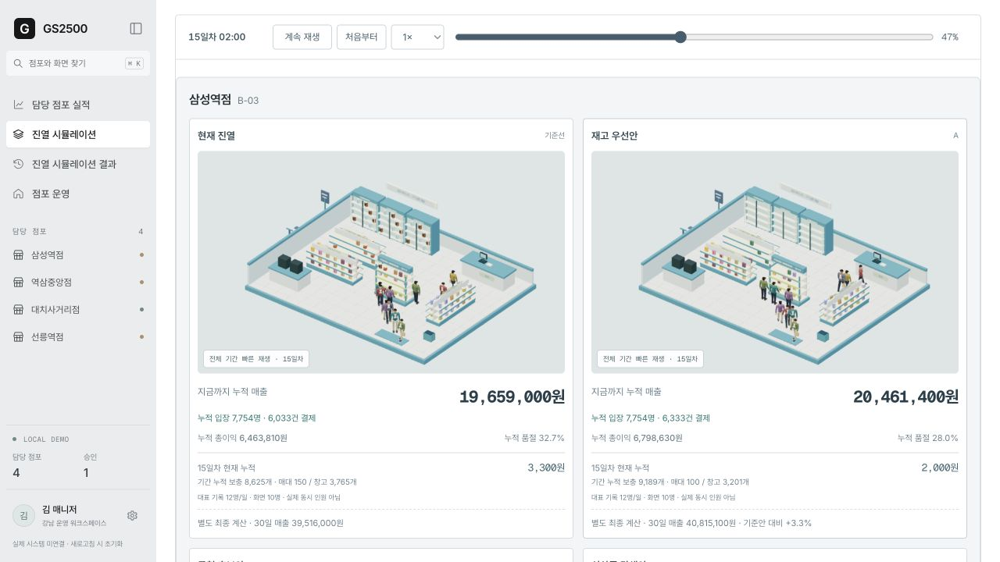

> GS 개발자 리그 해커톤용 작동 데모입니다. 점포·상품·매출·행사는 합성 데이터이며, 실제 GS25 내부 시스템과 연결되어 있지 않습니다. 메인 워크스페이스는 **로컬 규칙으로 계산**하며 JEV를 호출하지 않습니다. 예상 매출은 실제 성과나 보장치가 아닙니다.

| 비교 대상 | 실험 기간 | 고객 설정 | 실행 원칙 |
| --- | --- | --- | --- |
| 합성 점포 4곳 × 현재안·후보 3개 = 16개 비교 | 안별 30일 | 공개 합성 페르소나 1,000개 · 하루 1,000회 잠재 방문 기회 | 같은 조건으로 비교 · 관리자가 승인한 안만 점주에게 표시 |

<a id="business-impact"></a>
## 1. Business Impact — 추천과 실행 사이의 간극을 줄입니다

본사 표준 진열이 있어도 모든 점포가 같은 답을 실행할 수는 없습니다. 취급 상품과 창고 재고가 다르고, 눈높이 선반의 공간은 한정되어 있으며, 점주는 새 상품을 발주하기 전에 이미 가진 물량을 먼저 소진해야 할 수도 있습니다.

GS2500은 “무엇이 잘 팔릴까?”를 “이 점포의 어느 칸을, 왜, 지금 바꿀 것인가?”라는 실행 가능한 질문으로 좁힙니다.

| 현장의 질문 | GS2500이 연결하는 판단 |
| --- | --- |
| 여러 담당 점포 중 어디부터 볼까? | 전년 동기비·목표 달성률로 검토 우선순위를 확인 |
| 지금 이 매대를 바꿔야 하는 이유는? | 시의성, 온라인 관심, 유사 상권 사례, 과거 판매 이력을 근거 카드로 설명 |
| 새 발주 없이 가능한가? | 보유 상품의 단·열·이웃 관계를 바꾸고 매대·창고 재고를 함께 계산 |
| 매출만 높고 작업은 너무 어렵지 않을까? | 예상 매출·총이익·결품과 작업 부담·발주 조건을 함께 비교 |
| 점주에게 무엇을 전달할까? | 승인한 한 가지 안과 변경 위치, 안내 문구만 전달하는 데모 흐름 |
| 적용 이후에는 무엇을 확인할까? | 2주·4주 경과 제안의 매출·품절·부분 적용 이력을 추적 |

추천 근거의 표현과 실제 증거는 구분합니다. 현재 시의성·트렌드·유사 점포 사례는 **작성된 데모 가정**이며, 실시간 SNS 분석이나 실제 성공 사례를 확보했다는 뜻이 아닙니다.

### 매출 이전에, 실행 가능한 결정을 만듭니다

본사는 표준안을 제공하지만 현장은 재고·상권·작업 여력이 다릅니다. 따라서 GS2500의 첫 고객 가치는 **검토 시간을 줄이고, 실행할 수 있는 제안의 비율을 높이며, 적용 이후의 부진까지 놓치지 않는 것**입니다. 매출 개선은 이 과정을 실제 점포에서 검증한 뒤 평가할 장기 성과입니다.

| 사용자 | 제품이 줄이려는 비용·불확실성 | 파일럿에서 측정할 KPI — 아직 실측하지 않음 |
| --- | --- | --- |
| 영업관리자 | 여러 점포의 자료를 모아 설명하고 승인안을 만드는 반복 작업 | 점포 선택→승인 소요 시간, 검토 점포 수, 재작업률 |
| 점주 | 불필요한 추가 발주와 무엇을 바꿔야 할지 모르는 실행 부담 | 제안 채택·부분 실행·거절률, 실제 진열 작업 시간, 추가 발주 필요량 |
| 본사 | 성공 사례만 남고 미회신·부진 원인은 사라지는 관리 공백 | 적용 후 추적률, 재지원 대상 발견률, 상권·조건별 반복 이슈 |
| 점포 손익 | 노출 기회 손실, 품절, 보유 재고의 낮은 회전 | 대상 SKU 매출총이익, 품절 시간, 재고 소진율 |

**검증 계획:** 유사 점포·비교 기간을 정하고 일부 SKU의 배치만 변경합니다. 가격·행사·입고·부분 실행 여부를 함께 기록한 뒤 대조군과 비교해 유지·수정·중단을 결정합니다. 합성 매출 상승률을 실제 ROI로 환산하거나 전국 점포로 외삽하지 않습니다.

<a id="product-completeness"></a>
## 2. Product Completeness — 화면이 아니라 하나의 업무 흐름

| 업무 단계 | 현재 동작 | 완료 판단의 기준 |
| --- | --- | --- |
| 발견 | 담당 점포 실적과 검토할 매대·추천 이유 | 어떤 점포의 어떤 문제인지 맥락 유지 |
| 비교 | 4점포 × 4안의 30일 로컬 계산과 3D 대표 재생 | 같은 입력으로 재현, 수치와 공간이 같은 기록 사용 |
| 결정 | 예상 매출·총이익·결품·작업 부담을 보고 승인 | 계산 전 승인 차단, 승인한 안을 스냅샷으로 보존 |
| 실행 | 점주에게 변경 칸·이유·안내문 제공 | 미승인안 비노출, 전체·부분 실행·거절과 사진 접수 |
| 추적 | 14일·28일이 지난 적용 사례와 이번 세션의 회신 | 과거 합성 성과와 신규 승인을 섞지 않음 |
| 다음 행동 | 운영 이슈·사람이 확인한 관찰에 따른 추천 갱신 | 근거·미확인 사실·확인할 행동을 구분 |

2026-09-22 기준 **자동 검사 389개 통과**, 실제 브라우저의 승인·점주 회신·사진 오류·3D 연결 실패 경로를 확인했습니다. 최초 통합 흐름은 도구 왕복을 포함해 **51.907초**에 클릭 완료했고, 이후 변경된 화면도 재검사했습니다. 이 시간은 초기 UI의 단일 실행 기록이며 현재 UI의 사용성 평균이나 서비스 성능 보장이 아닙니다. [검증 기록](workspace/VERIFICATION.md)

현재 완결성의 범위는 **로컬 의사결정 데모**입니다. 실제 계정 간 전달·POS·영구 저장·자동 학습은 다음 단계이며, 3D가 실패해도 계산·승인·점주 가이드의 핵심 흐름은 유지되도록 분리했습니다.

<a id="quickstart"></a>
## Quickstart

필요 환경은 **Node.js 22 이상**, npm, WebGL을 지원하는 최신 브라우저입니다. 메인 데모 실행에 API 키·클라우드 계정·Blender 설치는 필요하지 않습니다.

```bash
git clone https://github.com/jin-ttao/gs2500.git
cd gs2500

npm --prefix demo ci
npm run build
npm start
```

[http://127.0.0.1:4175](http://127.0.0.1:4175)를 열고 **데모 로그인**을 누릅니다. 실제 계정이나 비밀번호를 입력하지 않습니다.

- 서버는 빌드된 `dist/`를 제공합니다. 소스를 수정한 뒤에는 `npm run build`를 다시 실행하고 브라우저를 새로고침합니다.
- 승인·점주 응답·사용자 관찰·사진은 현재 탭의 메모리에만 보관됩니다. 새로고침하거나 데모를 초기화하면 사라집니다.
- 현재 문서의 기준 실행 환경은 로컬입니다. 별도 공개 배포 URL의 최신 상태를 보장하지 않습니다.

### 추천 데모 동선

1. **담당 점포 실적**에서 역삼중앙점을 선택합니다.
2. **재고 우선안**의 추천 이유와 초록색으로 표시된 변경 칸을 확인합니다.
3. **로컬 규칙으로 30일 비교 시작**을 눌러 현재안과 세 후보를 계산합니다.
4. 3D 카드와 수치를 비교하고 후보 상세에서 **이 옵션으로 간다**를 누릅니다.
5. 안내 문구를 검토해 승인한 뒤 **점주 화면**에서 선택한 안만 보이는지 확인합니다.
6. **진열 시뮬레이션 결과**에서 과거 적용 사례를, **점포 운영**에서 이슈·관찰·다음 제안을 살펴봅니다.

방금 승인한 제안에 2주·4주 성과가 즉시 생기지는 않습니다. 과거 적용 사례와 현재 세션에서 보낸 제안은 분리됩니다.

<a id="codex"></a>
## 3. Built with Codex — 결과를 위임하고, 증거로 닫았습니다

### `/goal`을 작업 계약으로 사용

[보존한 `/goal` 원문](goal-prompt.md)은 **문제와 사용자 → 완료 상태 → 확인 기준 → 제약·판단 범위 → 허브 운영 → 검증·종료**를 명시합니다. 세부 화면 표현은 에이전트가 판단하되, 유료 서비스·실제 데이터 연동·삭제·목표 변경은 사용자 승인 경계로 두었습니다.

개발 중 추가된 요구는 원문을 소급 수정하지 않고 구분합니다. 현재 통합 앱의 **별도 30일 모형**, **로컬호스트 우선**, **이미 적용한 제안의 결과 추적**은 후속 요청을 반영한 범위입니다. 기존 24시간 실험실은 보존했습니다. [목표와 현재 결과의 대응표](docs/judging-evidence.md#goal)

### 허브가 맡기고, 하위 작업이 검증 가능한 단위로 반환

| 라우팅한 작업 | 세션에서 확인한 작업명 예시 | 통합한 결과 |
| --- | --- | --- |
| 데이터·상태·화면 계약 분리 | `workflow_data`, `workflow_state`, `workflow_views` | 합성 시나리오, 승인 상태, 관리자·점주 흐름 |
| 계산과 3D의 일치 | `unified_ledger`, `unified_ui`, `card_layout_fix` | 공유 계산 기록, 카드 내부 렌더링, 별도 매출 계산 제거 |
| 운영·적용 이력 | `operations_loop`, `proposal_history_model`, `proposal_history_view` | 관찰 근거와 다음 제안, 2주·4주 적용 사례 추적 |
| 독립 검증·통합 전 점검 | `sync_verification`, `premerge_tests`, `history_integration_tests` | 재현성·예산·재고·승인·필터·회귀 검사 |

여기서 **라우팅은 역할별 작업 분배**를 뜻합니다. 자동 비용 기반 멀티모델 라우터를 구현했다는 뜻은 아닙니다. 허브가 공통 계약과 파일 경계를 정하고 결과를 통합했으며, 모델 호출 수 자체보다 수정 후 같은 실패를 재현·검사하는 데 중점을 두었습니다.

### GPT-6 Astra를 어디에 활용했나

로컬 허브 세션에서 `gpt-5.6-sol`과 `gpt-6-astra` 사용을 확인했습니다. Astra가 사용된 구간에서는 역할별 병렬 위임, 기존 3D와 새 업무 화면의 연결, 수치·재생 불일치 진단, 브라우저 검증을 수행했습니다. 코드와 브라우저를 오가는 다단계 작업, 요구 변경을 반영하며 작업을 이어가는 특성에 맞춘 활용입니다. 이는 모델 간 성능 비교 실험의 결과가 아니라 **실제 맡긴 작업의 설명**입니다. [OpenAI 공식 GPT-6 Astra 가이드](https://developers.openai.com/api/docs/guides/latest-model)

| 실패를 발견한 지점 | 수정 후 확인한 결과 |
| --- | --- |
| 카드와 3D 캔버스가 따로 스크롤됨 | 카드 내부 렌더링으로 변경, 16개 카드의 좌표·크기 불일치 0 |
| 처음부터 실행해도 매출이 곧바로 다시 누적됨 | 일시정지→시작점 복원, 16개 카드 0원·대표 인원 0 유지 |
| 배속과 캐릭터의 움직임이 맞지 않음 | 4×에서 이동·동작·자세 시계가 4배 진행, 최종 매출 불변 |
| 후보 상세에서 돌아오면 맥락을 잃음 | 스크롤 2,760px 및 12일차 일시정지 상태 복원 확인 |

**확인 가능한 활용 규모:** 2026-09-22 11:37 KST까지 로컬 허브 세션 1개에서 응답별 사용량 기록 **1,510건**, 하위 작업 생성 호출 **32회**, 완료 턴 **57개**를 집계했습니다. 다른 기기·자식 세션·포크는 합산하지 않았습니다. 입력·출력·캐시 토큰, 시간의 정의, 커밋별 결과는 [심사 근거 문서](docs/judging-evidence.md#usage)에 명시합니다. 제품 런타임의 JEV 호출과 개발 도구인 Codex 활용은 별개입니다.

> 원문 파일은 목표의 내용에 대한 증거이며, 그 자체가 실제 `/goal` 실행 로그는 아닙니다. 팀이 다른 기기에서 실행한 `/goal`과 에이전트 결과는 별도 제출 세션 JSONL로 대조해야 합니다. 공개 저장소에는 비밀값이 포함될 수 있는 원본 대화 로그를 올리지 않습니다.

<a id="product-tour"></a>
## Product Tour

아래 15장은 **2026-09-22 로컬 앱에서 직접 캡처한 화면**입니다. 목업이 아닌 실행 화면이며, 화면 속 매출과 이력은 합성 예시입니다. 캡처 원본은 [docs/screenshots](docs/screenshots)에 보관합니다.

### 01. 담당 점포 실적 — 지원할 점포를 먼저 찾습니다

네 점포의 전년 동기비·매출·목표 달성률을 한눈에 확인하고, 선택한 점포의 매대로 들어갑니다. 이 실적은 점포 전체 지표이며 뒤에서 계산하는 24개 SKU의 예상 매출과 다릅니다.

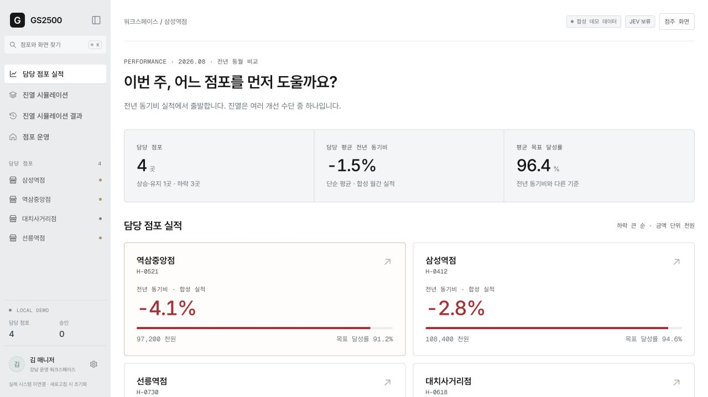

<details>
<summary>진단 대기 매대 목록 보기</summary>

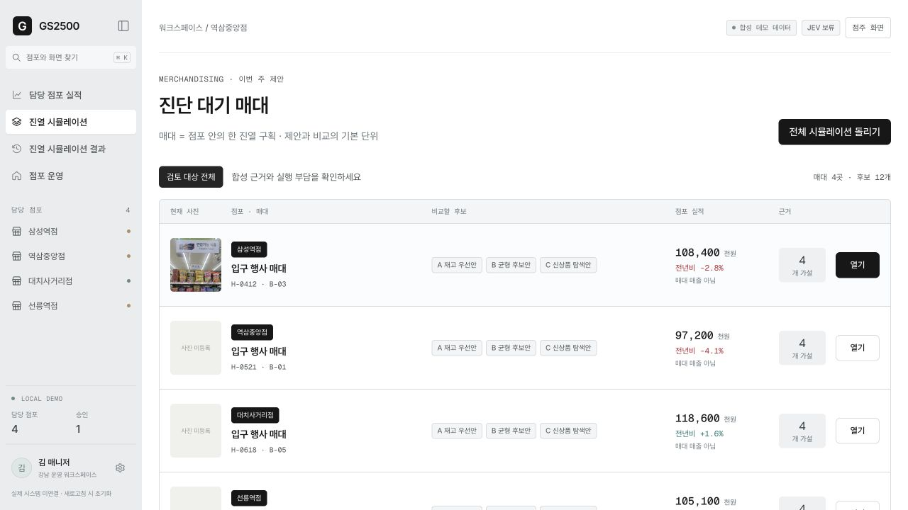

한 행이 점포 안의 한 진열 구획입니다. 각 매대에서 세 가지 후보, 점포 실적, 검토할 가설을 확인할 수 있습니다.

</details>

### 02. 추천 근거와 선반 도식 — “왜 지금, 어디를?”에 답합니다

역삼중앙점 재고 우선안은 주변 행사·온라인 관심·유사 역세권 사례·과거 판매 이력이라는 네 관점으로 제안 이유를 설명합니다. 각 설명에 데모 가정임을 함께 표시합니다.

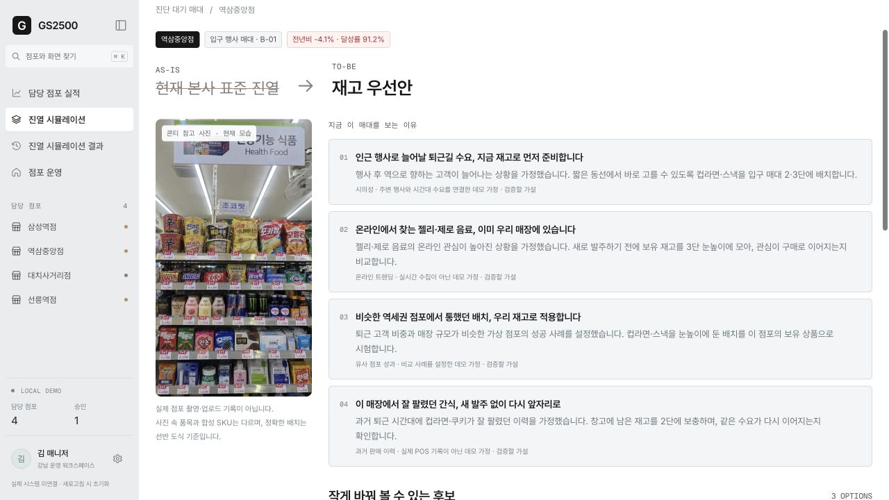

4단 × 6열의 같은 상품을 현재안과 후보안으로 나란히 보여줍니다. **바뀌는 칸만 초록색 테두리·배경·이동 배지로 강조**하고, 나머지는 유지합니다. 참고 사진 속 상품과 합성 SKU는 다르므로 정확한 변경 위치는 선반 도식을 기준으로 봅니다.

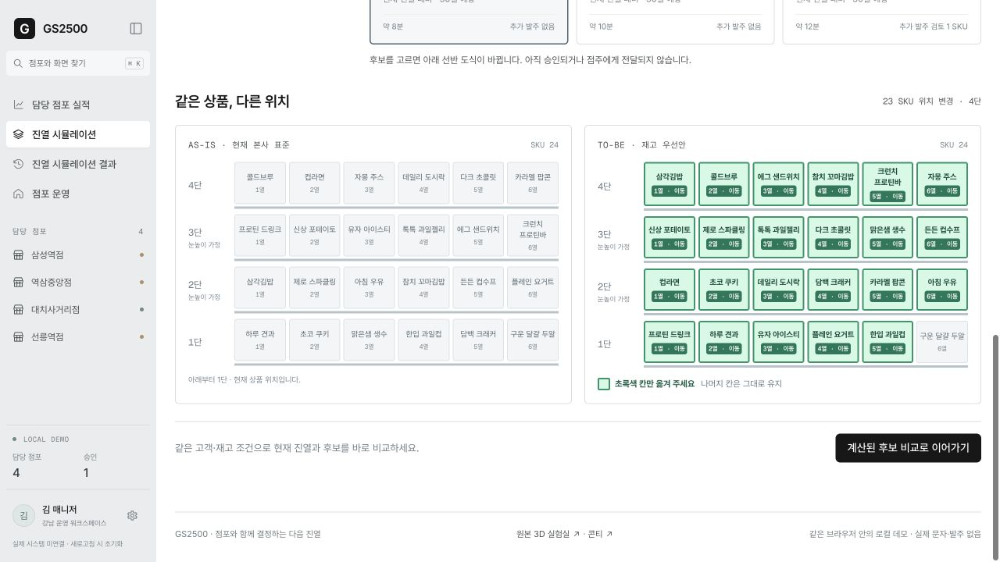

### 03. 다중 진열 비교 — 숫자와 공간을 같은 기록으로 봅니다

점포마다 현재안과 세 후보를 묶어 비교합니다. 누적 매출은 0원부터 시작하고, 재생 위치·일시정지·배속을 공통으로 제어합니다. 카드를 열면 선택한 진열의 대표 방문과 30일 최종 예상·작업 부담을 함께 볼 수 있습니다.

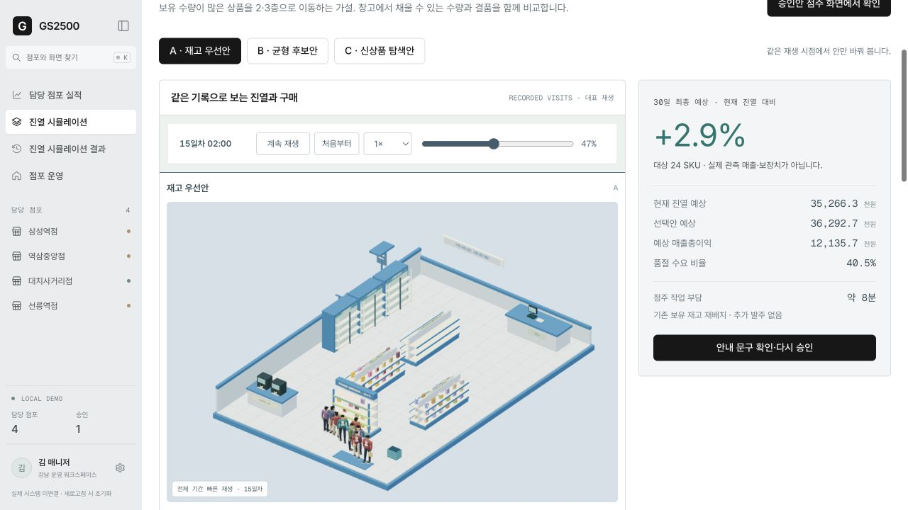

3D는 계산이 끝난 방문 기록의 **대표 표본 재생**입니다. 모든 고객의 실시간 동시성이나 정확한 결제 순간을 재현하지 않으며, 캐릭터 재생이 별도 매출을 만들지 않습니다.

### 04. 관리자 승인 → 점주 실행 — 결정과 실행의 경계를 둡니다

예상 변화, 작업 시간, 추가 발주 여부와 안내 문구를 검토한 뒤 승인합니다. 승인 전 후보는 점주에게 보이지 않으며, 승인 후 선택한 점포·매대·후보만 노출합니다.

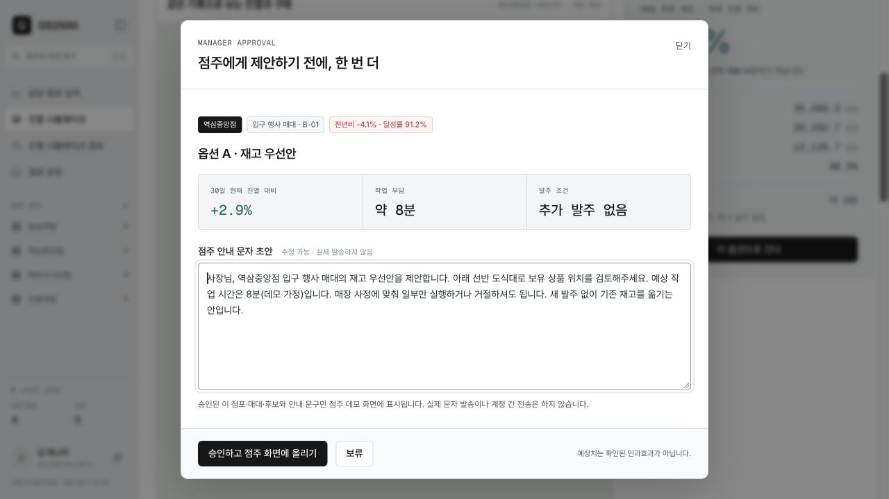

<details>
<summary>승인된 점주용 실행 가이드 보기</summary>

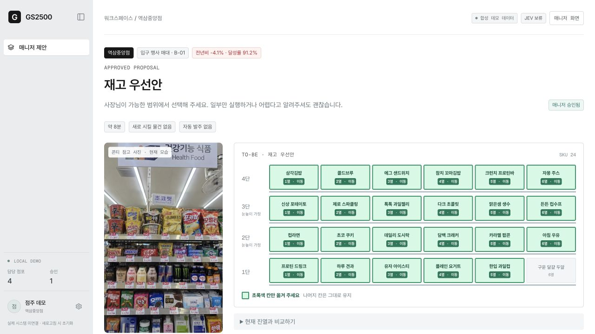

점주는 전체 실행·부분 실행·거절을 선택하고 현장 기록을 남길 수 있습니다. 실제 문자 발송, 계정 간 전송, 자동 발주는 하지 않습니다. 화면상의 역할 분리는 데모 상태이며 운영용 인증·권한 시스템은 아닙니다.

</details>

### 05. 진열 시뮬레이션 결과 — 이미 적용한 제안을 추적합니다

미래에 무엇을 보라는 가이드가 아니라, **적용 후 14일·28일이 지난 합성 사례**를 확인하는 화면입니다. 같은 길이의 적용 전후 기간, 주차별 매출, 품절 시간, 전체·부분 적용과 후속 메모를 비교합니다. 개선된 사례뿐 아니라 재점검이 필요한 사례도 포함합니다.

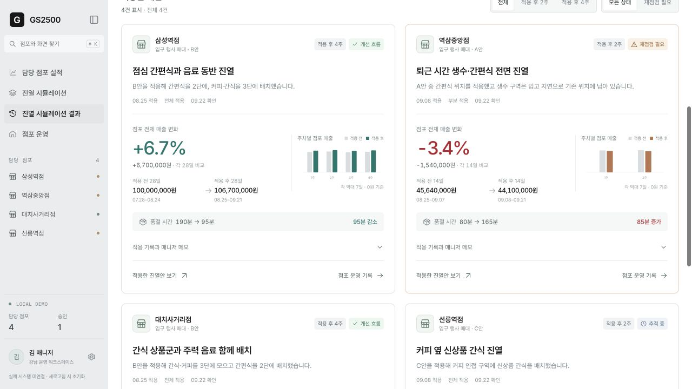

<details>
<summary>전체 추적 현황과 기간·상태 필터 보기</summary>

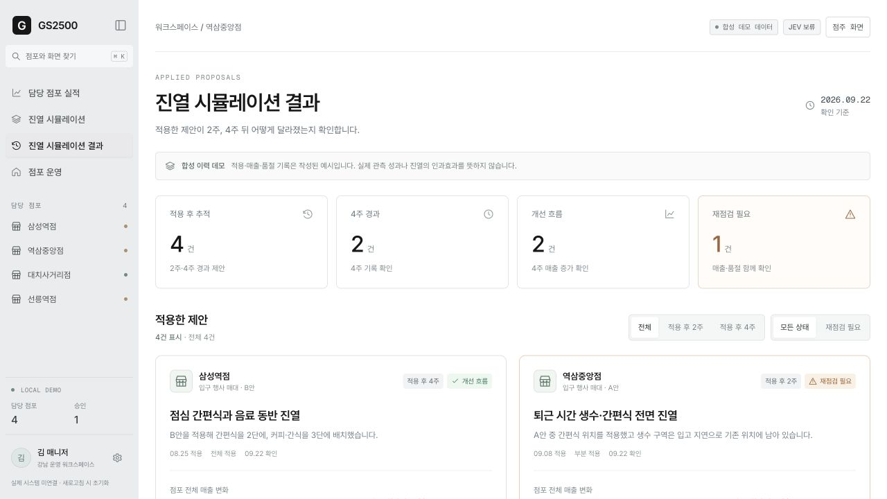

네 과거 제안은 별도로 작성한 합성 이력입니다. 전후 매출 변화는 진열 변경만의 인과효과나 현재 시뮬레이션의 정확도를 입증하는 값이 아닙니다.

</details>

### 06. 점포 운영 — 기록에서 다음 행동으로 이어집니다

점포 사진, 매출의 흐름, 품절·날씨·행사·진열 변경 기록을 모읍니다. 다음 제안은 상품과 위치, 확인할 사실, 필요한 행동까지 구체화합니다. 예를 들어 매대가 비었다면 새 배치보다 **창고 재고와 보충부터 확인**하도록 안내합니다.

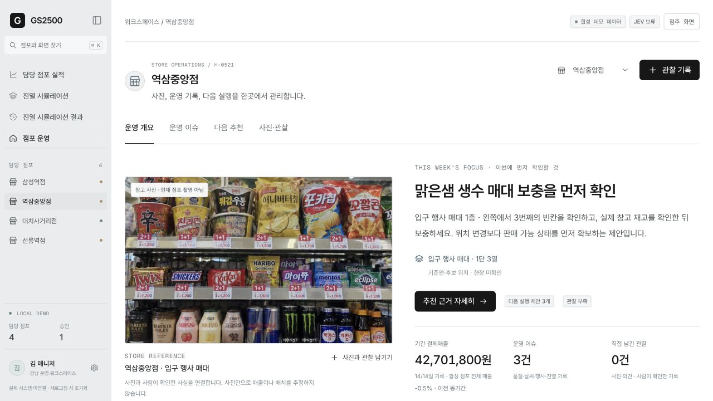

<details>
<summary>매출 차트와 운영 이슈 타임라인 보기</summary>

#### 매출의 흐름, 그날의 맥락

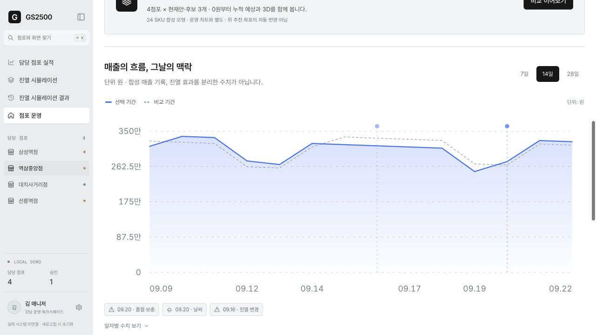

7·14·28일 조회와 비교 기간, 날짜별 이슈를 함께 확인합니다. 화면의 전후 변화가 검증된 인과효과라는 뜻은 아닙니다.

#### 운영 타임라인

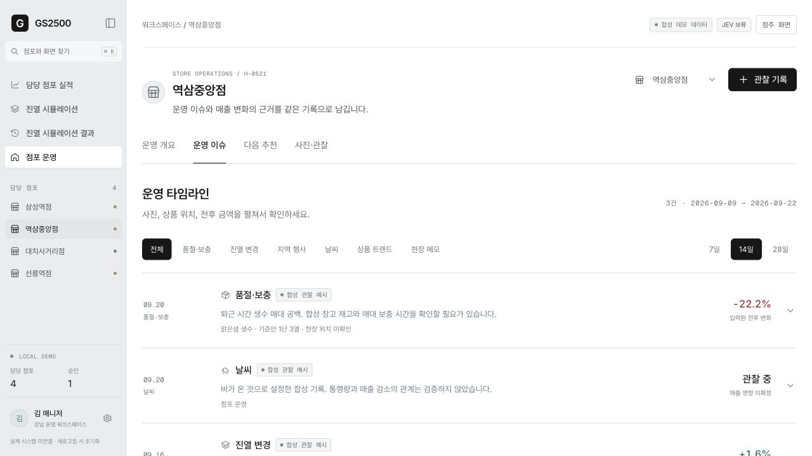

기록마다 날짜·출처·위치·전후 수치와 확인 여부를 구분합니다. 알 수 없는 영향은 숫자를 만들어 채우지 않고 관찰 중으로 남깁니다.

</details>

<details>
<summary>구체적인 추천 카드와 사진·관찰 입력 보기</summary>

#### 다음 실행 제안

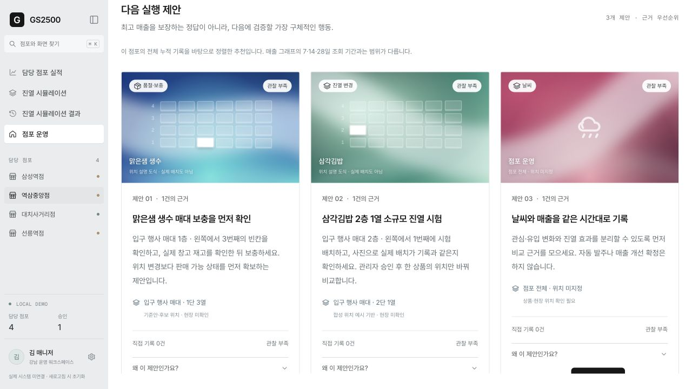

추천의 근거 수, 직접 기록 여부와 관찰 부족 상태를 표시합니다. 관찰을 저장하면 규칙 기반 추천 근거가 갱신되지만, 이 좌표가 기존 30일 후보에 자동 반영되지는 않습니다.

#### 사진과 사람이 확인한 사실

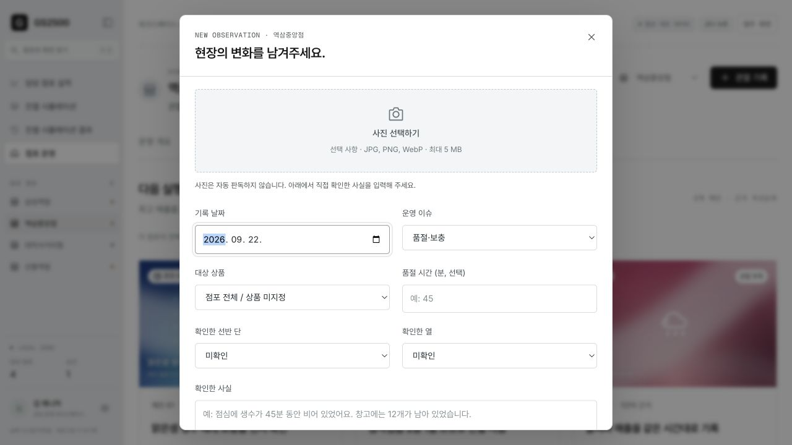

사진은 선택 사항이며 JPG·PNG·WebP, 최대 5 MiB를 허용합니다. 브라우저에서만 읽고 자동 상품 인식이나 모델 학습을 실행하지 않습니다.

</details>

<a id="simulation"></a>
## Simulation Model

### 같은 조건에서 진열만 바꿉니다

통합 워크스페이스의 후보는 다음과 같습니다. 별도 3D 실험실의 A–D 표기와 다르므로 내부 연결에는 시나리오 키를 사용합니다.

| 화면 | 시나리오 키 | 비교하려는 가설 |
| --- | --- | --- |
| 현재 진열 | `hq` | 본사 표준 배치를 기준선으로 유지 |
| A · 재고 우선안 | `owner` | 보유 수량이 많은 상품을 눈높이 구역으로 이동 |
| B · 균형 후보안 | `balanced` | 간편식·음료 등의 보완 관계와 이웃 위치를 고려 |
| C · 신상품 탐색안 | `discovery` | 합성 신상품을 접근하기 쉬운 구역에 모아 탐색 |

각 점포의 안들은 **같은 페르소나·방문 기회·예산·날짜·난수·초기 재고·배송 계획**을 공유합니다. 서로 다른 손님 운으로 생긴 차이를 줄이고 상품 위치의 영향을 비교하기 위한 설계입니다. 매장 전체 구조를 자동 최적화하는 알고리즘은 아닙니다.

### 계산 규칙

구현은 [workspace/forecast.js](workspace/forecast.js), 데이터 계약은 [workspace/CONTRACT.md](workspace/CONTRACT.md)에 있습니다.

| 단계 | 현재 규칙 | 해석 |
| --- | --- | --- |
| 잠재 방문 | 점포별 하루 1,000회 기회를 시간대·주말·행사 가정에 따라 배분 | 모두 입점하지 않으며 모두 구매하지 않음 |
| 상품 인지 | 1–4단 기본 노출 0.32 / 0.73 / 0.78 / 0.40, 중앙 가산 최대 0.06, 좌우 보완 상품 가산 0.055 | 실측 계수가 아닌 비교 실험 가정 |
| 구매 의도 | 선호도, 명시적 목적·제약, 가격 부담, 신상품 선호, 입력 기억, 이벤트를 로컬 규칙으로 반영 | 자유로운 서사를 완전히 이해하는 소비자 모델이 아님 |
| 결제 | 선택·예산·매대 재고 검사를 통과한 상품만 구매 | 창고에서 선반으로 옮기는 행위는 매출이 아님 |
| 보충 | 매시간 매대가 용량의 35% 이하이면 창고의 가용 재고로 보충 | 직원의 실제 이동·작업 시간은 계산하지 않음 |
| 납품 | 2일차부터 매일 06시, 초기 SKU 총재고의 26%를 내림하여 입고 | 모든 안에 같은 고정 합성 계획 적용, 실제 발주 없음 |
| 이벤트 | 퇴근 시간 비, 신상품 관심 상승, 인근 행사 등을 날짜·시간·상품 계수로 기록 | 실제 날씨·SNS·축제 데이터를 수집한 결과가 아님 |

```text
예상 매출       = Σ(결제 수량 × 상품 가격)
예상 매출총이익 = Σ(결제 수량 × [상품 가격 − 합성 원가])
품절 수요 비율  = 미충족 구매 시도 수량 / 전체 구매 시도 수량
기준안 대비     = (후보 예상 매출 − 현재안 예상 매출) / 현재안 예상 매출 × 100
```

상품 원가는 간편식 71%, 음료 64%, 스낵 62%, 건강식 68%의 가격 비율을 10원 단위로 반올림한 합성 값입니다. 총이익은 **순이익이 아니며**, 인건비·임대료·폐기·유통기한·세금은 포함하지 않습니다. 시도 수량이나 기준안 매출이 0이면 해당 비율은 0으로 처리하는 계산상 보호 조건을 사용합니다.

### 0원부터 재생하되, 결과를 다시 만들지 않습니다

1. Worker가 현재안과 후보의 30일 결과를 계산합니다.
2. 안별로 30개 일자 합계, 720개 시간 구간, SKU 결제·재고 이동과 대표 방문 기록을 만듭니다.
3. 수치 UI와 3D가 **같은 기록**을 읽습니다. 시간 구간이 끝나면 누적 결제·재고가 반영됩니다.
4. 처음부터 재생하면 누적 매출·입장 수와 캐릭터를 시작 상태로 되돌립니다. 별도로 표시한 30일 최종 예상은 계산 결과로 남습니다.
5. 0.5×·1×·2×·4×는 재생과 이동 속도만 바꾸며 최종 구매·매출은 바꾸지 않습니다.

기본 재생은 30일을 약 45초에 보여주며 **계산 준비 시간은 별도**입니다. 상세 방문은 입장자가 있는 시간당 최대 1명씩 기록하고, 화면은 하루 최대 12명의 대표 기록을 사용합니다. 이동·체류는 시각화용 보간이며 전체 고객 동선·혼잡의 예측이 아닙니다.

### 숫자의 범위를 섞지 않습니다

| 화면의 숫자 | 대상·기간 | 생성 방식 |
| --- | --- | --- |
| 담당 점포 실적 | 점포 전체 실적·목표·전년 동기비 | 합성 실적 fixture |
| 진열 비교 | 대상 24 SKU · 30일 | 재현 가능한 로컬 시뮬레이션 |
| 진열 시뮬레이션 결과 | 과거 적용 전후 각각 14일 또는 28일 · 점포 전체 | 별도 작성한 합성 적용 이력 |
| 점포 운영 차트 | 선택한 7·14·28일 · 점포 전체 | 합성 운영 매출 기록 |
| 직접 입력한 관찰 | 사용자가 확인한 날짜·상품·위치·사실 | 현재 탭에서 사람이 작성 |

예를 들어 캡처의 역삼중앙점 A안 +2.9%는 현재안 대비 24 SKU의 30일 모형 차이입니다. 과거 적용 이력의 −3.4%는 별도 합성 사례의 14일 점포 전체 전후 비교이므로 두 수치로 예측 오차를 계산하면 안 됩니다.

### Persona provenance

[NVIDIA Nemotron-Personas-Korea](https://huggingface.co/datasets/nvidia/Nemotron-Personas-Korea)의 **합성 인물 원본 레코드 1,000개**를 로컬에 포함합니다. 실제 한국인 1,000명이나 관측된 GS25 고객 구매 이력이 아닙니다.

- 고정 리비전: `ada0f5b53a38bb5a30cce09358adde883c1ab63a`.
- 원본 행 번호를 20개 구간으로 나누고 각 구간의 연속 50행을 결정적으로 선택했습니다. 인구통계적 대표 표본이 아닙니다.
- 원문 이야기와 원본 ID를 보존하며 예산·선호도·시간대·구매 규칙은 별도 가정으로 구분합니다.
- 메인 앱은 이 로컬 카탈로그를 로드한 뒤 계산합니다. 로딩 실패를 기존 5종 프로필로 몰래 대체하지 않습니다.
- 같은 페르소나가 여러 날짜·후보에서 반복 평가됩니다. 30일 방문 기회를 서로 다른 실제 고객 수로 해석하지 않습니다.

**출처:** NVIDIA Corporation — Nemotron-Personas-Korea, CC BY 4.0. GS2500이 부분표본을 선택하고 시뮬레이션용 가정 파라미터를 별도로 작성함. 추출 방법·무결성 해시·변환 경계는 [페르소나 출처 문서](demo/data/PERSONA-SOURCE.md)를 참고하세요.

<a id="architecture"></a>
## Architecture

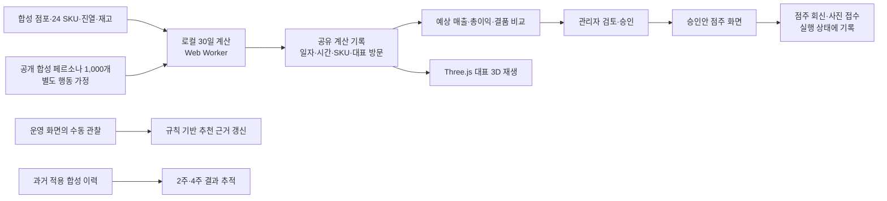

운영 화면의 관찰 → 추천은 연결되어 있지만, 점주 회신·사진 접수가 이 관찰로 자동 전환되지는 않습니다. **사진 → 자동 인식 → 예측 모델 학습 → 진열 자동 최적화**는 아직 구현되지 않았습니다. 관찰 기반 추천과 기존 고정 진열 후보의 계산도 분리되어 있습니다.

| 계층 | 구현 |
| --- | --- |
| 앱·상태·라우팅 | Vanilla JavaScript ES modules, HTML 템플릿, CSS, hash route |
| 디자인 | 팀 소유 Obolus의 레이아웃·표현 요소를 기존 JS/CSS 구조로 포트 |
| 차트 | SVG 기반 매출 추이·동기간 비교·주차별 막대 |
| 공간 렌더링 | Three.js 0.180.0, 로컬 3D 자산, 공유 기록 기반 재생 |
| 계산 | 시드가 고정된 로컬 수요·재고 규칙, Web Worker |
| 실행 | Node.js 로컬 정적 서버, 명시적 런타임 파일 목록으로 빌드 |
| 저장 | 통합 워크스페이스는 현재 탭 메모리, 백엔드 DB 없음 |

### Repository map

```text
gs2500/
├── index.html                      # 통합 워크스페이스 진입점
├── workspace/
│   ├── app.js / state.js            # 탐색, 역할, 승인, 실행 상태
│   ├── views.js / data.js           # 점포·매대·후보 화면과 합성 데이터
│   ├── forecast*.js                 # 30일 계산·Worker·작업 수명 관리
│   ├── ledger-replay.js             # 공유 기록의 시간·집계·대표 재생
│   ├── world-view.js               # 기존 3D 렌더러와 연결
│   ├── operations*.js              # 매출·이슈·관찰·다음 추천
│   ├── proposal-history*.js        # 과거 적용 제안의 추적·비교
│   ├── obolus* / assets/           # 디자인 포트와 로컬 자산
│   └── *.test.js                   # 모델·상태·컨트롤러·뷰 검사
├── demo/                           # 보존한 독립 24시간 3D 실험실
│   ├── data/                       # 합성 페르소나 표본과 출처
│   └── assets/                     # 매장·캐릭터 자산
├── scripts/                        # 빌드·정적 서버·별도 실험 도구
├── design/reference/               # 제품 콘티
├── docs/screenshots/               # 이 README의 실제 화면 15장
└── research/                       # 조사 자료와 출처
```

### 통합 워크스페이스와 독립 실험실

| 구분 | 통합 워크스페이스 — 기본 진입점 | 독립 3D 실험실 |
| --- | --- | --- |
| 사용자 가치 | 비교·승인·점주 실행·운영 추적 | 에이전트 동선·인지·결제·보충 실험 |
| 규모·기간 | 4점포 × 4안 · 30일 | 9개 공간 × 4안 · 24시간 |
| 후보 표기 | 현재=`hq`, A=`owner`, B=`balanced`, C=`discovery` | A=`hq`, B=`owner`, C=`balanced`, D=`discovery` |
| 3D와 경제 계산 | 30일 기록을 대표 재생 | 라이브 공간 엔진 또는 기록 재생 |
| 실행 | 루트에서 `npm start` · 4175 | `npm --prefix demo start` · 4173 |
| JEV | 기본 실행 경로 미연결 | 별도 서버의 명시적 선택 기능, 기본은 로컬 |

4175의 `/demo/`는 실험실의 **정적 버전**입니다. 선택적 JEV 서버 기능까지 사용하려면 독립 서버가 필요합니다. 자세한 조작·맵·제약은 [3D 실험실 README](demo/README.md)를 참고하세요.

JEV 요청 계약과 게이트웨이 실험 코드가 저장소에 있다는 사실이 메인 화면에서 JEV가 호출된다는 뜻은 아닙니다. 현재 README 캡처와 메인 데모는 외부 유료 모델을 사용하지 않습니다.

<a id="verification"></a>
## Verification

2026-09-22 문서·캡처 갱신 시점에 다음 명령을 다시 실행해 통과를 확인했습니다. `npm test`는 워크스페이스 **221개**와 기존 3D 실험실 **168개**, 총 **389개**입니다.

```bash
npm run check   # app.js · world-view.js 구문 검사
npm test        # workspace/*.test.js + demo/*.test.js
npm run build   # 통합 화면, 3D 실험실, 로컬 자산 빌드
```

| 검증 영역 | 확인하는 불변 조건 |
| --- | --- |
| 비교 재현성 | 같은 입력·시드·코호트의 결과 일치, 후보 간 조건 공유 |
| 결제·재고 | 예산·가용 재고 검사, 보충과 판매 분리, 재고 이동과 결제 합계 |
| 재생 | 배속·프레임 분할로 최종 결과 불변, 일시정지·초기화·탐색 일관성 |
| 승인 | 미승인 후보 비공개, 승인한 점포·매대·안만 점주에게 표시 |
| 관찰·사진 | 잘못된 입력 거부, 비동기 사진 처리 경합·초기화·URL 정리 |
| 결과 추적 | 14/28일 비교 기간, 필터 교집합, 적용 상태와 집계 |
| UI 상태 | 같은 화면의 필터·대화상자·후보 변경 시 스크롤·입력 보존 |

`npm test`에는 `scripts/jev-gateway.test.mjs`와 별도 브라우저 스크립트가 포함되지 않습니다. 로컬 단위 테스트 통과는 JEV 실호출 성공, 실제 매출 예측 정확도, 운영용 보안 검증을 의미하지 않습니다.

캡처 과정에서는 브라우저에서 **점포 선택 → 진단 → 30일 계산 → 재생 위치 이동 → 후보 상세 → 승인 → 점주 화면**, 그리고 과거 제안 추적·운영 차트·이슈·추천·관찰 폼을 직접 확인했습니다. 이번 README 작업에서 모바일을 새로 재검증하거나 JEV 유료 호출을 실행하지는 않았습니다.

더 자세한 검사 기록: [워크스페이스 검증](workspace/VERIFICATION.md) · [3D 실험실 검증](demo/VERIFICATION.md).

<a id="scope"></a>
## Scope & Next Steps

### 현재 제공하는 것

- 점포 실적에서 진열 후보 비교·승인·점주 실행까지 이어지는 로컬 업무 흐름.
- 단·열·이웃 관계와 매대·창고 재고를 반영하는 설명 가능한 30일 비교.
- 같은 계산 기록에 연결된 3D 대표 재생과 매출·결품·보충 집계.
- 과거 적용 사례의 동일 기간 비교와 운영 이슈·사용자 관찰·추천 근거 관리.

### 아직 제공하지 않는 것

- 실제 GS25 POS·전국 점포 데이터·발주·결제·메시지 연동.
- 실시간 온라인 트렌드 수집, 검증된 유사 점포 성공 사례 검색.
- 사진 자동 판독, 개인별 행동을 완전히 해석하는 JEV 추론, 누적 모델 학습.
- 매장 전체 구조·통로·혼잡·직원 이동을 포함한 30일 매출 최적화.
- 재방문 결과의 자동 기억 축적, 유통기한·폐기·인건비를 포함한 순이익 추정.
- 서버 저장·사용자 인증·다중 사용자 협업·운영용 접근 제어.

### 제품화 순서

1. **현장 사실을 구조화:** 사진·실제 SKU 위치·재고·품절 시간을 사람이 확인하고 POS 기간과 연결합니다.
2. **예측을 검증:** 동일 조건 비교뿐 아니라 홀드아웃 점포·기간과 대조 실험으로 오차와 불확실성을 측정합니다.
3. **판단 모델을 평가:** JEV를 제한된 의사결정부터 연결하고, 페르소나 제약·가격·위치 변경 반례와 호출 비용을 기록합니다.
4. **관찰을 다음 실험에 반영:** 확인된 위치·이슈를 후보 생성 입력으로 연결한 뒤, 검증된 변화만 추천 규칙이나 모델에 반영합니다.
5. **운영 기반을 추가:** 영구 저장·권한·감사 기록·안전한 외부 연동을 갖춘 후 실제 점포 파일럿으로 확장합니다.

이 순환이 목표하는 것은 매출 보장이 아니라, **어떤 제안을 왜 실행했고 무엇이 달라졌는지 설명하며 다음 결정을 더 잘 내리는 것**입니다.

## Documentation & Credits

| 문서 | 내용 |
| --- | --- |
| [심사 기준별 근거](docs/judging-evidence.md) | `/goal` 대응, 범위 변경, Codex 집계 방법, 위임·수정·검증 이력 |
| [보존한 `/goal` 원문](goal-prompt.md) | 목표·완료 상태·확인 기준·제약·판단 범위·종료 조건 |
| [제품 브리프](docs/product-brief.md) | 해결할 문제와 제품 방향 |
| [공유 맥락](docs/shared-context.md) | 프로젝트 의사결정 배경 |
| [화면·상태·계산 계약](workspace/CONTRACT.md) | 현재 구현의 연결 범위와 경계 |
| [원본 콘티 HTML](design/reference/gs2500-storyboard-handoff.html) | 업무 흐름의 디자인 참고 |
| [페르소나 출처](demo/data/PERSONA-SOURCE.md) | 원본 보존·샘플링·가정·라이선스 |
| [맵 구성](demo/MAPS.md) | 독립 실험실의 공간 변형 |
| [3D 자산 기록](demo/assets/ASSET_NOTES.md) | 모델·리깅·자산 제작 및 제한 |
| [Obolus 포트 기록](workspace/OBOLUS-PORT.md) | 팀 허가, 파일별 재사용 범위와 글꼴 고지 |
| [리서치 인덱스](research/README.md) | 공개 자료와 조사 기록 |

- **UI:** 팀 저장소 [Obolus](https://github.com/DanRo-AX/Obolus-GoogleCloudAI-Solana)의 허가된 표현 요소를 GS2500의 HTML/CSS 구조로 포트했습니다. 원본 결제·지갑·외부 API는 가져오지 않았습니다. React나 원본 서비스 전체를 통합한 프로젝트가 아닙니다.
- **문서 구성:** [Airlock](https://github.com/yc9954/airlock)의 문제 정의 → 실제 화면 → 구조·검증 순서를 참고했습니다. 기능·수치·검증 주장은 GS2500의 현재 코드와 캡처를 기준으로 작성했습니다.
- **데이터:** NVIDIA 합성 페르소나 부분표본은 CC BY 4.0이며 원본·변경 사실을 위에 표시했습니다.
- **의존성과 글꼴:** Three.js는 MIT, 동봉한 Inter·Wanted Sans·Geist Mono는 OFL 1.1입니다. 개별 라이선스와 출처 고지를 따릅니다.
- 저장소 전체에 적용되는 별도 오픈소스 라이선스는 현재 지정되어 있지 않습니다. 공개 저장소라는 사실이 모든 코드·이미지의 포괄적 재사용 허가를 뜻하지는 않습니다.

**GS2500은 GS25 공식 운영 시스템이나 검증된 매출 예측 서비스가 아닌 해커톤 프로토타입입니다.**
